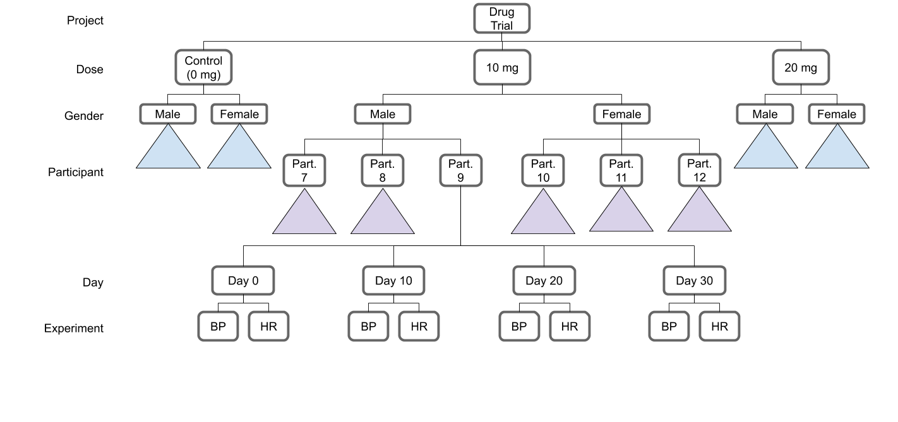

########
Examples
########

Consider a new drug we are testing. The main hypothesis of our investigation is at what dose the drug should be taken. We will try two different doses, as well as have a control group whose dose is 0. We know from other studies that the sort of drug we are testing affects men and women differently, so we will split our participants by their gender. In each of these groups we will have three participlants. Each participant will come in every ten days, starting from their first dose, to have their blood pressure and heart rate monitored for thirty days. Thus our tree will have six levels:

1. Project
2. Dose
3. Gender
4. Participant
5. Day
6. Experiment

This leads us to the structure tree seen in :numref:`Fig. %s <local_project_organization>`. In this example there would be :math:`3 \,[doses]* 2 \,[\frac{genders}{dose}]* 3 \,[\frac{participants}{gender}] * 4 \,[\frac{days}{participant}]* 2 \,[\frac{experiments}{day}] =  144 \,[experiments]`. Even for this quite limited study managing and aanlyzing this data would be difficult. Using Thot though, we can simplify the process significantly.

.. _local_project_organization:

	Example project organization